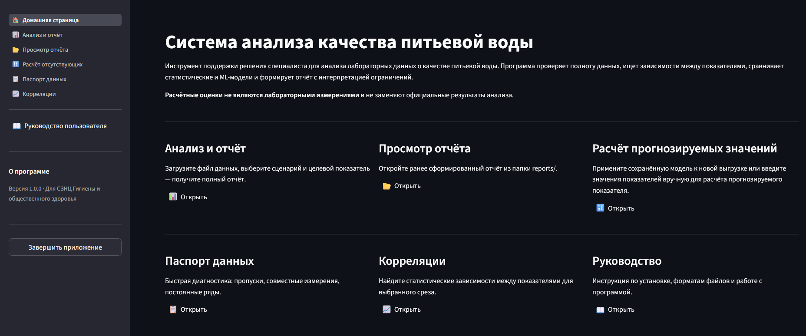

# water_analysis

Программа для анализа лабораторных данных о качестве питьевой воды и поддержки решения специалиста‑гигиениста с возможностью прогнозирования показателя воды по совокупности других показателей. Работает с выгрузками результатов лабораторных исследований и испытаний качества питьевой воды централизованных систем водоснабжения, выполнение в рамках социально-гигиенического мониторинга, проводимого органами Роспотребнадзора, и производственного контроля, проводимого ресурсоснабжающими организациями в формате CSV и XLSX.

Это не «чёрный ящик» и не автоматический предсказатель. Прежде чем обучать модель, программа проверяет полноту и пригодность данных, считает зависимости между показателями, честно сравнивает ML‑модели с простыми базовыми моделями и явно сообщает об ограничениях результата.

## Что делает

- читает лабораторные выгрузки CSV и XLSX, сохраняя полный код точки отбора `ОКТМО.ТипТочки.НомерТочки`;
- строит паспорт данных: пропуски, совместные измерения, цензурированные и постоянные ряды;
- проверяет пригодность данных к моделированию для выбранного показателя;
- ищет корреляции по выбранному сценарию анализа;
- сравнивает базовые и ML‑модели и формирует отчёт с таблицами, графиками и интерпретацией;
- применяет ранее обученную модель для расчётной оценки прогнозируемых значений.

## Чего не делает

- не заменяет результаты лабораторных исследований и испытаний;
- не исправляет исходные данные и не перезаписывает их;
- не гарантирует пригодность модели для каждого ОКТМО или точки отбора;
- не является веб‑сервисом, базой данных или готовым перечнем.

## Быстрый старт (Windows Powershell)

```powershell
python -m venv .venv
.\.venv\Scripts\Activate.ps1
python -m pip install --upgrade pip
python -m pip install -e .[dev,ui]
```

Запуск графического интерфейса:

```powershell
water-analysis ui
```

Браузер откроется автоматически на `http://localhost:8501`. Команда `water-analysis ui` равнозначна прямому вызову `streamlit run streamlit_app/app.py`.

Для пошаговой инструкции специалиста см. **[docs/user_guide.md](docs/user_guide.md)** (она же доступна в самом приложении на странице «Руководство пользователя»).



## Два способа работы

| Интерфейс | Для кого                                                     | Запуск |
|-----------|--------------------------------------------------------------|--------|
| Графический (Streamlit) | специалисты без опыта работы с интерфейсом командной строки  | `water-analysis ui` |
| Командная строка (CLI) | автоматизация, повторяемые запуски, продвинутые пользователи | `water-analysis <команда>` |

> P.S. перед запуском любой команды `water-analysis ...` убедитесь, что ранее была активирована среда Python (в начале командной строки написано `(.venv)`; ранее в терминал вводилась команда `.\.venv\Scripts\Activate.ps1`)

Оба интерфейса используют одну и ту же библиотеку и дают одинаковые результаты. UI вызывает Python‑API напрямую — без запуска CLI в фоне.

## Входные данные

Программа принимает лабораторную таблицу CSV или XLSX. **Обязательные столбцы** (без них запуск невозможен):

| Канонический столбец | Смысл                    | Пример                 |
|----------------------|--------------------------|------------------------|
| `SampleDate`         | дата исследования        | 15.03.2023             |
| `FullPointCode`      | полный код точки отбора  | 30000000001.10110.0010 |
| `Indicator`          | гигиенический показатель | Жесткость общая        |
| `ResultValueText`    | результат исследования   | 4,2                    |

Остальные столбцы (норматив, пределы обнаружения, документ, цель исследования и т. п.) необязательны: при их отсутствии программа продолжает работу и пишет предупреждение в лог.

Цензурированные записи вида `<0.05`, `>1.0` и интервалы распознаются; метаданные цензурирования сохраняются отдельно, значение не выдаётся за точно измеренное.

### Профили формата

Разные поставщики данных могут выгружать данные с разными именами столбцов, содержащих данные одного и того же вида (например, "Дата проведения испытания" vs "Дата"). В качестве основного (по умолчанию) взят формат, рекомендуемый отделениями Роспотребнадзора. Для удобства комплекс поддерживает создание своих **профилей источника** (`configs/source_profiles/*.yaml`).

#### Основной формат столбцов (минимально достаточный набор столбцов):

| Название столбца             | Пример значения        |
|------------------------------|------------------------|
| Дата проведения исследования | 15.03.2023             |
| Код точки                    | 30000000001.10110.0010 |
| Гигиенический показатель     | Жесткость общая        |
| Результат исследования       | 4,2                    |

По умолчанию программа определяет, к какому профилю относится загруженная таблица, автоматически. Можно указать его явно (`--source-profile secondary`) или создать свой YAML по образцу `configs/source_profiles/_default.yaml` и передать путь к нему. Кроме формата по умолчанию в исходном коде представлен ещё один (`configs/source_profiles/secondary.yaml`) для демонстрационных целей.

## Код точки и сценарии анализа

Полный код точки отбора имеет вид `ОКТМО.ТипТочки.НомерТочки`, например `30000000001.10110.0010`, и всегда сохраняется целиком. Типы точек:

- `10110` — распределительная сеть;
- `10150` — водопровод;
- `10310` — водоисточник (поверхностный);
- `10320` — водоисточник (подземный).

Сценарий анализа определяет, какие точки объединяются в один срез:

| Сценарий | Срез |
|----------|------|
| `global` | весь набор данных |
| `oktmo` | по ОКТМО |
| `oktmo_point_type` | по ОКТМО и типу точки |
| `drinking_water_combined` | питьевая вода `10110 + 10150` по ОКТМО |
| `point` | отдельная физическая точка отбора |

Разные физические точки не смешиваются, кроме явного выбора `drinking_water_combined` или `oktmo_point_type`. Сводная таблица строится на уровне `sample_point_level` (дата + полный код точки).

## Команды CLI

Все команды запускаются из корня проекта и принимают `--input` (CSV или XLSX). Настройки по умолчанию — в `configs/default.yaml`; переопределяются через `--config`.

| Команда | Назначение |
|---------|------------|
| `normalize` | сырой файл → канонический длинный формат (CSV) |
| `pivot` | сырой файл → сводная таблица показателей (CSV) |
| `profile` | паспорт данных: пропуски, совместные измерения, постоянные ряды |
| `readiness` | проверка пригодности данных к моделированию |
| `correlate` | корреляции по выбранному сценарию |
| `compare-models` | сравнение базовых и ML‑моделей без сохранения пакета |
| `train` | обучение одной модели после проверок |
| `report` | полный workflow → отчётный пакет для специалиста |
| `estimate-missing` | применение сохранённого пакета модели для оценки пропусков в файле |
| `estimate-manual` | оценка по введённым вручную значениям показателей (без входного файла) |
| `ui` | запуск графического интерфейса |

> `estimate-manual` — единственная команда, которая работает без `--input`: значения показателей задаются парами `--value "Показатель=Значение"`.

Полная справка по аргументам: `water-analysis --help` или `water-analysis <команда> --help`.

## Основной workflow

1. Построить отчёт на исторических данных:

```powershell
water-analysis report `
  --input data/raw/main.csv `
  --scope drinking_water_combined `
  --oktmo 30000000001 `
  --target "Жесткость общая" `
  --output-dir reports\water_report
```

2. Прочитать `reports\water_report\summary\specialist_summary.md`.

3. Если данные пригодны и модель обучена, применить пакет к новой выгрузке, где целевой показатель отсутствует:

```powershell
water-analysis estimate-missing `
  --input data/new_measurements.csv `
  --model-package reports\water_report\models\best_model_package `
  --output-dir reports\estimate_run
```

Либо, если файла нет, — ввести значения показателей вручную. `--date` важна для сезонных моделей; `--output-dir` необязателен (без него результат только печатается в консоль):

```powershell
water-analysis estimate-manual `
  --model-package reports\water_report\models\best_model_package `
  --value "Цветность=12" `
  --value "Мутность (по формазину)=0.8" `
  --date 2024-07-15 `
  --output-dir reports\estimate_manual_run
```

Какие показатели ожидает модель, можно посмотреть командой
`water-analysis estimate-manual --model-package <пакет> --list-features`.

## Где искать результаты

Отчётный пакет (`report`):

```text
reports/water_report/
  summary/specialist_summary.md     краткий отчёт для специалиста
  tables/*.csv, *.xlsx              паспорт, корреляции, сравнение моделей
  plots/*.png                       графики: предсказания, остатки, бэктест, тепловые карты
  metadata/                         readiness.json, run_parameters.json, run.log
  models/                           обученные модели и best_model_package/
```

Результаты оценки пропусков (`estimate-missing`, а также `estimate-manual` с `--output-dir` — структура одинаковая):

```text
reports/estimate_run/
  predictions.csv / .xlsx           все строки, где была попытка оценки
  estimated_values_long.csv / .xlsx только успешные оценки (ValueSource=estimated)
  inference_diagnostics.csv / .xlsx почему строки пропущены
  inference_summary.md              краткий итог
```

CSV‑файлы содержат стабильные технические имена столбцов для машинной обработки. Рядом лежат XLSX с русскими заголовками, фильтрами и закреплённой строкой — для просмотра в Excel.

## Как читать результаты

Статус пригодности данных:

- `suitable` — данных достаточно для моделирования;
- `weakly_suitable` — модель можно обучить, но ограничения существенны;
- `unsuitable` — обучение блокируется; паспорт данных и корреляции остаются как диагностический результат.

«Лучшая модель» и «модель лучше базовой» определяются по **комбинированному скору** (holdout 40 % + backtest 60 %), а не по одному финальному тесту. Если ML не превосходит базовую модель, отчёт сообщает об этом прямо. Подробное объяснение статусов, скора и стабильности — в **[docs/user_guide.md](docs/user_guide.md)**.

## Документация

- **[docs/user_guide.md](docs/user_guide.md)** — руководство пользователя (установка, форматы файлов, работа в интерфейсе, интерпретация результатов).

## Установка на Linux/macOS

```bash
python -m venv .venv && source .venv/bin/activate
python -m pip install --upgrade pip
python -m pip install -e '.[dev,ui]'
water-analysis ui
```

## Тесты

```bash
pytest                                  # все тесты
pytest tests/unit/test_readiness.py     # один файл
```

Быстрая проверка установки: `.\scripts\smoke_check.ps1` (Windows) или `bash scripts/smoke_check.sh` (Linux/macOS).
